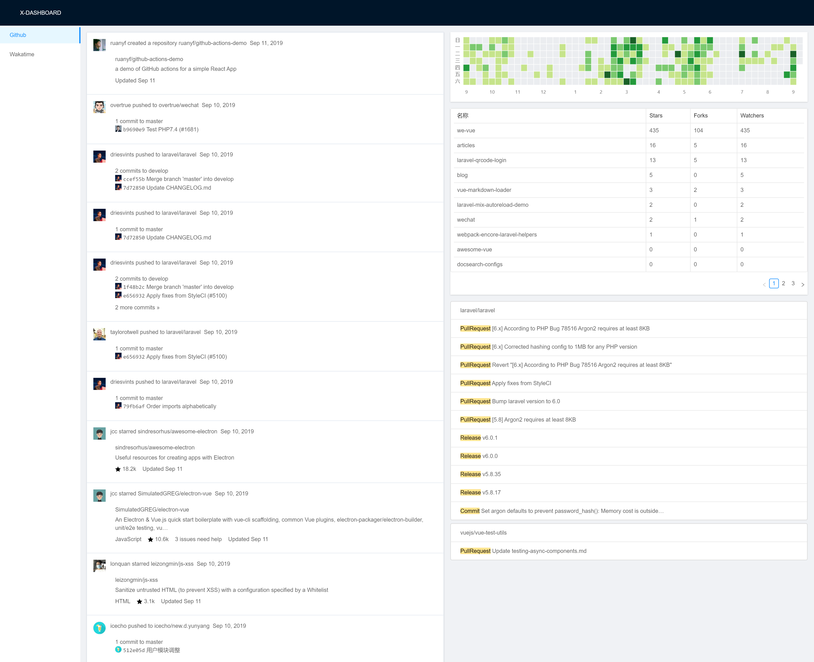
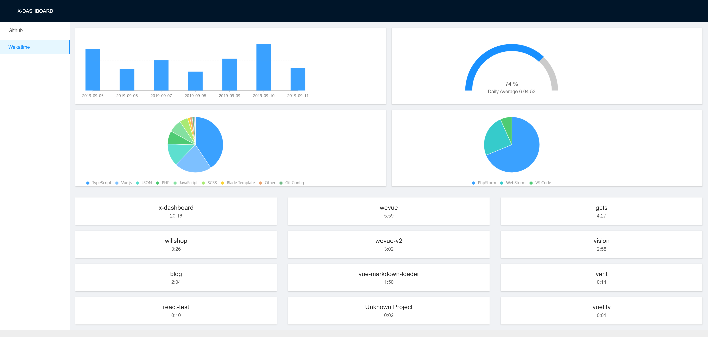

# x-dashboard

x-dashboard 利用 github 和 wakatime 官方提供的 api，将程序员日常关注的信息整合到一起，方便查阅，避免每天辗转于不同网站和页面浪费时间。在这里你可以方便地查看自己相关的 github 消息，通知，自己各仓库的 star 数等信息，同时可以知道近七天 wakatime 相关统计数据，自己写了多少 bug，摸了多久鱼一目了然。

## 截屏




## 使用的技术／工具栈

- laravel 6
- webpack-encoee
- react
- antd
- antv/g2
- typescript
- github api
- wakatime api
- tailwindcss

## 如果使用

1. 克隆本仓库到本地

```bash
git clone https://github.com/tianyong90/x-dashboard.git
```

2. 安装前后端依赖

```bash
composer install

yarn install
```

3. 配置

```bash
cp .env.example .env
```
然后根据 .env 文件中的注释配置好 github token, wakatime api key 等参数。

4. 构建前端资源

```bash
yarn run production
```

5. 配置站点

因为目前并没有作授权登录等相关功能，所以推荐只部署为本地站点

6. 访问部署好的站点，如 http://x-dashboard.test

## 后续

本项目算是自己一个练手性质的项目，因为刚学 react 不久（之前几年中一直使用 vue)，所以有些地方可能不太科学规范，后期会逐步完善。此外，也有意继续整合其它消息源或者工作中使用频繁的工具（功能）到一起，成为一个工具平台。如果有兴趣，欢迎各们提建议或者 PR。

## License

MIT
